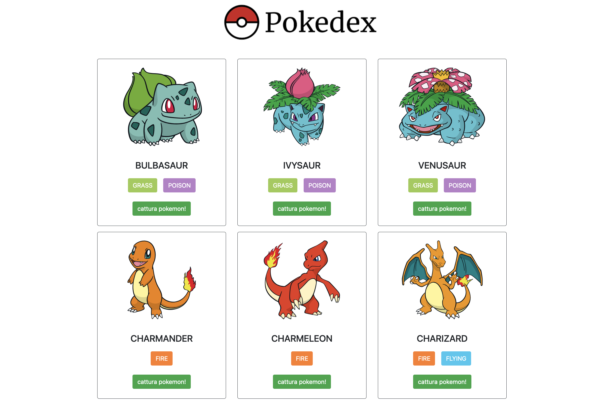

# React Pokemon App

A simple React App to show pokemon, their caratheristics and catch 'em all!


## How to start it 

Download this repo, open a terminal in the project forlder, then:
```bash 
  npm install
  npm start
```
The app will run by default on localhost:3000/
## Author

- [@michelebaruffetti](https://github.com/michelebaruffetti)

  
## Preview Image



  
